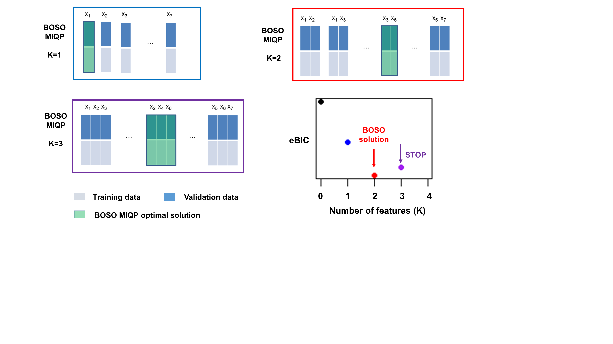

```{r LoadFunctions, echo=FALSE, message=FALSE, warning=FALSE, results='hide'}
library(knitr)
opts_chunk$set(error = FALSE)
library(BOSO)
library(dplyr)
library(kableExtra)
library(glmnet)
library(ggplot2)
library(ggpubr)
```

```{r style, echo = FALSE, results = 'asis'}
##BiocStyle::markdown()
```

# Installation
BOSO can be installed from CRAN repository:

```{r, eval=FALSE}
install.packages("BOSO")
```

Note that it is necessary to have  IBM ILOG CPLEX installed, with a version greater than 12.1, and the *cplexAPI* package, which is used to invoke CPLEX from R environment.

Furthermore, check if packages are installed. Check if bestsubset is installed.  If not, source necessary functions from bestsubset.

```{r, eval=FALSE}
if (!requireNamespace('cplexAPI', quietly = TRUE)) {
  testthat::skip('Package cplexAPI not installed (required for this vignette)!\n
         Install it from CRAN: https://cran.r-project.org/web/packages/cplexAPI/index.html')
  stop('Package cplexAPI not installed (required for this vignette)!\n
         Install it from CRAN: https://cran.r-project.org/web/packages/cplexAPI/index.html', call. = FALSE)
}
```

```{r, eval=TRUE}
if (!requireNamespace('bestsubset', quietly = TRUE)) {
  devtools::source_url("https://raw.githubusercontent.com/ryantibs/best-subset/master/bestsubset/R/fs.R")
  devtools::source_url("https://raw.githubusercontent.com/ryantibs/best-subset/master/bestsubset/R/lasso.R")
  devtools::source_url("https://raw.githubusercontent.com/ryantibs/best-subset/master/bestsubset/R/sim.R")
  enlist <- function (...) 
  {
    result <- list(...)
    if ((nargs() == 1) & is.character(n <- result[[1]])) {
      result <- as.list(seq(n))
      names(result) <- n
      for (i in n) result[[i]] <- get(i)
    } else {
      n <- sys.call()
      n <- as.character(n)[-1]
      if (!is.null(n2 <- names(result))) {
        which <- n2 != ""
        n[which] <- n2[which]
      }
      names(result) <- n
    }
    result
  }
} #else {require(bestsubset)}
```

# Introduction

The package is designed to run the BOSO algorithm in one single function, which comprises two steps: block strategy and final problem.

* The block strategy is a pre-processing step in which the BOSO MILP (Mixed-Integer Liner Programming) is applied to random subproblems of small dimension, aiming to discard variables for the final problem. The usual block size is 10 variables. This process is done iteratively until convergence.

* Final problem applies the BOSO MILP with all the remaining variables from the block strategy.



Figure 1 summarizes the *BOSO* algorithm. An example dataset with 7 features is split into training and validation sets. Green boxes represent optimal selected features for a Specific K value. For example, for K=2, the subset of features that minimizes the validation error is {X3, X6}. The problem of selecting the best subset of features of length K is formulated via mixed-integer quadratic programming (MIQP) and solved using IBM ILOG CPLEX This process is repeated for each K value until an information criterion, in this case the extended Bayesian Information Criterion (eBIC), is not further improved. Minimal eBIC is found in this example for K=2. The final model is derived from Ridge regression with only these two selected variables. 

# Different parameters that can be changed in the BOSO algortihm.

Function `BOSO` has a number of parameters that can be changed:

* *IC*  is the information criterion to be used. Options are AIC, BIC and eBIC
* *IC.blocks*  is the information criterion to be used in the block strategy step. By default, it is the same as the *IC*, but it can be changed. Additionally, if *IC* is eBIC, *IC.blocks* will be BIC.
* *nlambda* The number of lambda values in the final problem. Default value 100.
* *nlambda.blocks* The number of lambda values in the blocks strategy. Default value 10, in order to alleviate the block strategy.
* *TH_IC* Threshold for the stopping criterion in K selection. Default value 1e-3. We have a worse model if the IC is at least 0.1% higher than the current solution.  

On the other hand, there are some parameters that are identical to the ones found in the `glmnet` function: *lambda.min.ratio*,  *lambda*, *intercept*, *standardize* and *dfmax*.

Finally, some of the parameters  are solver-specific:

* *Threads* CPLEX parameter that defines the number of cores to be used. Default is 0 (automatic).
* *timeLimit* CPLEX parameter that defines the time limit per problem provided to CPLEX.Default value is 1e75 (infinite time).
* *warmstart* warmstart for CPLEX or use a different problem for each k. Default is False.


# Example: High-5 scenario discussed in the BOSO article

Given a synthetic data set (see Methods section in the article), we evaluate the capacity of BOSO to extract the features that are related with the response variable. First o, we set the parameters for the generation of  synthetic data:

```{r define_data, eval=TRUE}

# Set some overall simulation parameters
n = 100;          # Size of training set
nval = n          # Size of validation set
p = 10;           # Number of variables
s = 5             # Number of nonzero coefficients
beta.type = 1     # Type of coefficiente structure
rho.vec = 0.35    # Variable autocorrelation level
snr.vec = exp(seq(log(0.05),log(6),length=10)) # Signal-to-noise ratios 
nrep = 10          # Number of repetitions for a given setting
seed = 0          # Random number generator seed

```

Benchmarked methods are defined: Forward Stepwise, Lasso, Relaxed lasso and BOSO.

```{r define_funs, eval=TRUE}

# Regression functions: lasso, forward stepwise and BOSO
reg.funs = list()

reg.funs[["Forward stepwise"]] = function(x,y) fs(x,y,intercept=FALSE, max=min(n,p))

reg.funs[["Lasso"]] = function(x,y) lasso(x,y,intercept=FALSE,nlam=50)

reg.funs[["Relaxed lasso"]] = function(x,y) lasso(x,y,intercept=FALSE,
                                                  nrelax=10,nlam=50)

reg.funs[["BOSO - AIC"]] <- function(x,y,xval,yval) BOSO(x,y,xval,yval,
                                                         IC = "AIC",
                                                         nlambda = 100,
                                                         Threads = 4,
                                                         timeLimit = 60,
                                                         intercept = F,
                                                         standardize = F,
                                                         verbose = 0,
                                                         warmstart=T,
                                                         seed = 123456)

reg.funs[["BOSO - BIC"]] <- function(x,y,xval,yval) BOSO(x,y,xval,yval,
                                                         IC = "BIC",
                                                         nlambda = 100,
                                                         Threads = 4,
                                                         timeLimit = 60,
                                                         intercept = F,
                                                         standardize = F,
                                                         verbose = 0,
                                                         warmstart=T,
                                                         seed = 123456)

reg.funs[["BOSO - eBIC"]] <- function(x,y,xval,yval) BOSO(x,y,xval,yval,
                                                          IC = "eBIC",
                                                          nlambda = 100,
                                                          Threads = 4,
                                                          timeLimit = 60,
                                                          intercept = F,
                                                          standardize = F,
                                                          verbose = 0,
                                                          warmstart=T,
                                                          seed = 123456)

```


We have adapted the `sim.master`function from the *bestsubset* library function to assess the different methods. 

```{r aux_fun_1, eval=TRUE, echo=FALSE}
sim.master = function(n, p, nval, reg.funs, nrep=50, seed=NULL, verbose=FALSE,
                      file=NULL, file.rep=5, rho=0, s=5, beta.type=1, snr=1) {
  
  this.call = match.call()
  if (!is.null(seed)) set.seed(seed)
  
  N = length(reg.funs)
  reg.names = names(reg.funs)
  if (is.null(reg.names)) reg.names = paste("Method",1:N)
  
  err.train = err.val = err.test = prop = risk = nzs = fpos = fneg = F1 = 
    opt = runtime = vector(mode="list",length=N)
  names(err.train) = names(err.val) = names(err.test) = names(prop) =
    names(risk) = names(nzs) = names(fpos) = names(fneg) = names(F1) = 
    names(opt) = names(runtime) = reg.names
  for (j in 1:N) {
    err.train[[j]] = err.val[[j]] = err.test[[j]] = prop[[j]] = risk[[j]] =
      nzs[[j]] = fpos[[j]] = fneg[[j]] = F1[[j]] = opt[[j]] = runtime[[j]] =
      matrix(NA,nrep,1)
  }
  filled = rep(FALSE,N)
  err.null = risk.null = sigma = rep(NA,nrep)
  
  # Loop through the repetitions
  for (i in 1:nrep) {
    if (verbose) {
      cat(sprintf("Simulation %i (of %i) ...\n",i,nrep))
      cat("  Generating data ...\n")
    }
    
    # Generate x, y, xval, yval
    xy.obj = sim.xy(n,p,nval,rho,s,beta.type,snr)
    risk.null[i] = diag(t(xy.obj$beta) %*% xy.obj$Sigma %*% xy.obj$beta)
    err.null[i] = risk.null[i] + xy.obj$sigma^2
    sigma[i] = xy.obj$sigma
    
    # Loop through the regression methods
    for (j in 1:N) {
      if (verbose) {
        cat(sprintf("  Applying regression method %i (of %i): %s ...\n",
                    j,N, reg.names[j]))
      }
      
      tryCatch({
        # Apply the regression method in hand
        if (grepl("BOSO", reg.names[j])){
          runtime[[j]][i] = system.time({
            reg.obj = reg.funs[[j]](xy.obj$x,xy.obj$y,xy.obj$xval,xy.obj$yval)
          })[1]
        } else {
          runtime[[j]][i] = system.time({
            reg.obj = reg.funs[[j]](xy.obj$x,xy.obj$y)
          })[1]
        }
        
        # Grab the estimated coefficients, and the predicted values on the
        # training and validation sets
        betahat = as.matrix(coef(reg.obj))
        m = ncol(betahat); nc = nrow(betahat)
        
        # Check for intercept
        if (nc == p+1) {
          intercept = TRUE
          betahat0 = betahat[1,]
          betahat = betahat[-1,]
        }
        else intercept = FALSE
        
        muhat.train = as.matrix(predict(reg.obj,xy.obj$x))
        muhat.val = as.matrix(predict(reg.obj,xy.obj$xval))
        
        # Populate empty matrices for our metrics, of appropriate dimension
        if (!filled[j]) {
          err.train[[j]] = err.val[[j]] = err.test[[j]] = prop[[j]] =
            risk[[j]] = nzs[[j]] = fpos[[j]] = fneg[[j]] = F1[[j]] = opt[[j]] =
            matrix(NA,nrep,m)
          filled[j] = TRUE
          # N.B. Filling with NAs is important, because the filled flag could
          # be false for two reasons: i) we are at the first iteration, or ii)
          # we've failed in all previous iters to run the regression method
        }
        
        # Record all of our metrics
        err.train[[j]][i,] = colMeans((muhat.train - xy.obj$y)^2)
        err.val[[j]][i,] = colMeans((muhat.val - xy.obj$yval)^2)
        delta = betahat - xy.obj$beta
        risk[[j]][i,] = diag(t(delta) %*% xy.obj$Sigma %*% delta)
        if (intercept) risk[[j]][i,] = risk[[j]][i,] + betahat0^2
        err.test[[j]][i,] = risk[[j]][i,] + xy.obj$sigma^2
        prop[[j]][i,] = 1 - err.test[[j]][i,] / err.null[i]
        nzs[[j]][i,] = colSums(betahat!=0)
        tpos = colSums((betahat!=0)*(xy.obj$beta!=0))
        fpos[[j]][i,] = nzs[[j]][i,]-tpos
        fneg[[j]][i,] = colSums((betahat==0)*(xy.obj$beta!=0))
        F1[[j]][i,] = 2*tpos/(2*tpos+fpos[[j]][i,]+fneg[[j]][i,])
        opt[[j]][i,] = (err.test[[j]][i,] - err.train[[j]][i,]) /
          err.train[[j]][i,]
      }, error = function(err) {
        if (verbose) {
          cat(paste("    Oops! Something went wrong, see error message",
                    "below; recording all metrics here as NAs ...\n"))
          cat("    ***** Error message *****\n")
          cat(sprintf("    %s\n",err$message))
          cat("    *** End error message ***\n")
        }
        # N.B. No need to do anything, the metrics are already filled with NAs
      })
    }
    
  }
  
  # Save results now (in case of an error that might occur below)
  out = enlist(err.train,err.val,err.test,err.null,prop,risk,risk.null,nzs,fpos,
               fneg,F1,opt,sigma,runtime)
  # if (!is.null(file)) saveRDS(out, file)
  
  # Tune according to validation error, and according to test error
  out = choose.tuning.params(out)
  
  # Save final results
  out = c(out,list(rho=rho,s=s,beta.type=beta.type,snr=snr,call=this.call))
  class(out) = "sim"
  # if (!is.null(file)) { saveRDS(out, file); invisible(out) }
  # else 
  return(out)
}

```

```{r run_sims, eval=FALSE, echo=TRUE}

sim.results <- list()

for (i in 1:length(snr.vec)) {
  set.seed(i)
  sim.results[[i]]  <- sim.master(n = n, p = p, nval = nval,
                                  rho=rho.vec, s=s, beta.type=beta.type, 
                                  snr = snr.vec[[i]], 
                                  reg.funs, nrep=nrep, seed=i,
                                  verbose=T)
}

```

```{r load_sims, eval=TRUE, echo=FALSE}

data("SimResultsVignette",package = "BOSO")


```

## Comparison of BOSO with other methods

Finally, the next part of the code shows the comparison of BOSO-eBIC with some of the most widely used algorithms in the literature: Lasso, Relaxed lasso and Forward Stepwise.


```{r plot_function, eval=TRUE, echo=FALSE}

plot.from.sim = function(sim.list,
                         row=c("beta","rho","snr"), col=c("rho","beta","snr"),
                         method.nums=NULL, method.names=NULL,
                         what=c("error","risk","prop","F","nonzero", "fpos", "fneg"),
                         rel.to=NULL,
                         tuning=c("validation","oracle"), type=c("ave","med"),
                         std=TRUE, lwd=1, pch=19, main=NULL, ylim=NULL,
                         legend.pos=c("bottom","right","top","left","none")) {
  
  # Check for ggplot2 package
  if (!require("ggplot2",quietly=TRUE)) {
    stop("Package ggplot2 not installed (required here)!")
  }
  
  row = match.arg(row)
  col = match.arg(col)
  if (row==col) stop("row and col must be different")
  
  what = match.arg(what)
  tuning = match.arg(tuning)
  type = match.arg(type)
  legend.pos = match.arg(legend.pos)
  
  # Set the method numbers and names
  sim.obj = sim.list[[1]]
  if (is.null(method.nums)) method.nums = 1:length(sim.obj$err.test)
  if (is.null(method.names)) method.names = names(sim.obj$err.test[method.nums])
  N = length(method.nums)
  
  # Set the base number and name
  if (is.null(rel.to)) {
    base.num = 0
    base.name = ifelse(what=="error","Bayes","null model")
  } else {
    base.num = which(method.nums==rel.to)
    base.name = tolower(method.names[base.num])
  }
  
  # Set the y-label
  ylab = switch(what,
                error=paste0("Relative test error (to ",base.name,")"),
                risk=paste0("Relative risk (to ",base.name,")"),
                prop="Proportion of variance explained",
                F="F classification of nonzeros",
                nonzero="Number of nonzeros",
                fpos="Number of false positive",
                fneg="Number of false negative")
  
  # Collect the y-variable from the file list
  yvec = ybar = beta.vec = rho.vec = snr.vec = c()
  for (i in 1:length(sim.list)) {
    sim.obj = sim.list[[i]]
    beta.vec = c(beta.vec,rep(sim.obj$beta.type,N))
    rho.vec = c(rho.vec,rep(sim.obj$rho,N))
    snr.vec = c(snr.vec,rep(sim.obj$snr,N))
    
    z = sim.obj[[switch(what,
                        error="err.test",
                        risk="risk",
                        prop="prop",
                        fpos="fpos",
                        fneg="fneg",
                        F="F1",
                        nonzero="nzs")]]
    res = tune.and.aggregate(sim.obj, z)
    
    # For prop, F  and nonzero we ignore any request for a relative metric
    if (what=="prop" || what=="F" || what=="nonzero" || what=="fpos" || what=="fneg") {
      yvec = c(yvec,res[[paste0("z.",substr(tuning,1,3),".",type)]][method.nums])
      ybar = c(ybar,res[[paste0("z.",substr(tuning,1,3),".",
                                ifelse(type=="ave","std","mad"))]][method.nums])
    }    else {     # For err and risk we respect the request for a relative metric
      # First build the relative metric
      met = res[[paste0("z.",substr(tuning,1,3))]]#[method.nums]
      if (base.num == 0 && what=="error") denom = sim.obj$sigma^2
      else if (base.num == 0 && what=="risk") denom = sim.obj$risk.null
      else denom = met[[base.num]]
      z.rel = lapply(met, function(v) v / denom)
      # Now aggregate the relative metric
      res2 = tune.and.aggregate(sim.obj, z.rel, tune=FALSE)
      yvec = c(yvec,unlist(res2[[paste0("z.",type)]])[method.nums])
      ybar = c(ybar,unlist(res2[[paste0("z.",ifelse(type=="ave",
                                                    "std","mad"))]])[method.nums])
    }
  }
  # Set the x-variable and x-label
  xvec = snr.vec
  xlab = "Signal-to-noise ratio"
  
  # Set the y-limits
  if (is.null(ylim)) ylim = range(yvec-ybar, yvec+ybar)
  # Produce the plot
  beta.vec = factor(beta.vec)
  rho.vec = factor(rho.vec)
  snr.vec = factor(snr.vec)
  levels(beta.vec) = paste("Beta-type", levels(beta.vec))
  levels(rho.vec) = paste("Correlation", levels(rho.vec))
  
  dat = data.frame(x=xvec, y=yvec, se=ybar,
                   beta=beta.vec, rho=rho.vec, snr=snr.vec,
                   Method=factor(rep(method.names, length=length(xvec))))
  
  gp = ggplot(dat, aes(x=x,y=y,color=Method)) +
    xlab(xlab) + ylab(ylab) + coord_cartesian(ylim=ylim) +
    geom_line(lwd=lwd) + geom_point(pch=pch) +
    # facet_grid(formula(paste(row,"~",col))) +
    theme_bw() + theme(legend.pos=legend.pos)
  if (!("snr" %in% c(row,col))) {
    # If SNR is being plotted on the x-axis in each plot, then define special
    # x-axis ticks and put the x-axis on a log scale
    snr.breaks = round(exp(seq(from=min(log(xvec)),
                               to=max(log(xvec)),length=4)),2)
    gp = gp + scale_x_continuous(trans="log", breaks=snr.breaks)
  }
  if (std) gp = gp + geom_errorbar(aes(ymin=y-se,ymax=y+se), width=0.02)
  if (what=="error") gp = gp + geom_line(aes(x=x, y=1+x), lwd=0.5,
                                         linetype=3, color="black")
  if (what=="prop") gp = gp + geom_line(aes(x=x, y=x/(1+x)), lwd=0.5,
                                        linetype=3, color="black")
  if (what =="nonzero") gp = gp + geom_line(aes(x=x, y=sim.obj$s), lwd=0.5,
                                            linetype=3, color="black")
  if (!is.null(main)) gp = gp + ggtitle(main)
  if (!is.null(ylim)) gp = gp + coord_cartesian(ylim=ylim)
  else gp
  
  return(gp + ggtitle(ylab))
}

```


```{r plot_comparison_BOSOvsREST, eval=TRUE, warning=TRUE}

method.nums = c(6,1,2,3)
method.names = c("BOSO - eBIC","Forward stepwise","Lasso","Relaxed lasso")


plot.BOSO <- list(
  "F" = plot.from.sim(sim.list = sim.results, what="F", rel.to=NULL, tuning="val",
                      method.nums=method.nums, method.names=method.names),
  "nonzeros" = plot.from.sim(sim.list = sim.results, what="nonzero", rel.to=NULL, tuning="val",
                             method.nums=method.nums, method.names=method.names),
  "fpos" = plot.from.sim(sim.list = sim.results, what="fpos", rel.to=NULL, tuning="val",
                         method.nums=method.nums, method.names=method.names),
  "fneg" = plot.from.sim(sim.list = sim.results, what="fneg", rel.to=NULL, tuning="val",
                         method.nums=method.nums, method.names=method.names))

ggarrange(plotlist = plot.BOSO, ncol = 2, nrow = 2, common.legend = T, legend = "bottom")

``` 

## Comparison of BOSO with different information criteria

The following part of code is designed to compare the performance of the BOSO algorithm using different information criteria. The options available are AIC, BIC and eBIC.

```{r plot_comparison_BOSOvsBOSO, eval=TRUE, warning=FALSE}

method.nums = c(4, 5, 6)
method.names = c("BOSO - AIC","BOSO - BIC","BOSO - eBIC")

plot.BOSO <- list(
  "F" = plot.from.sim(sim.list = sim.results, what="F", rel.to=NULL, tuning="val",
                      method.nums=method.nums, method.names=method.names),
  "nonzeros" = plot.from.sim(sim.list = sim.results, what="nonzero", rel.to=NULL, tuning="val",
                             method.nums=method.nums, method.names=method.names),
  "fpos" = plot.from.sim(sim.list = sim.results, what="fpos", rel.to=NULL, tuning="val",
                         method.nums=method.nums, method.names=method.names),
  "fneg" = plot.from.sim(sim.list = sim.results, what="fneg", rel.to=NULL, tuning="val",
                         method.nums=method.nums, method.names=method.names))

ggarrange(plotlist = plot.BOSO, ncol = 2, nrow = 2, common.legend = T, legend = "bottom")

``` 


# References

* Luis V. Valcarcel, Edurne San José-Enériz, Xabier Cendoya, Ángel Rubio, Xabier Agirre, Felipe Prósper, Francisco J. Planes 'BOSO: a novel feature selection algorithm for linear regression with high-dimensional data.' submitted.

* Hastie, Trevor, Robert Tibshirani, and Ryan Tibshirani. "Best Subset, Forward Stepwise or Lasso? Analysis and Recommendations Based on Extensive Comparisons." Statistical Science 35.4 (2020): 579-592.


# Session Information
```{r}
sessionInfo()
```


